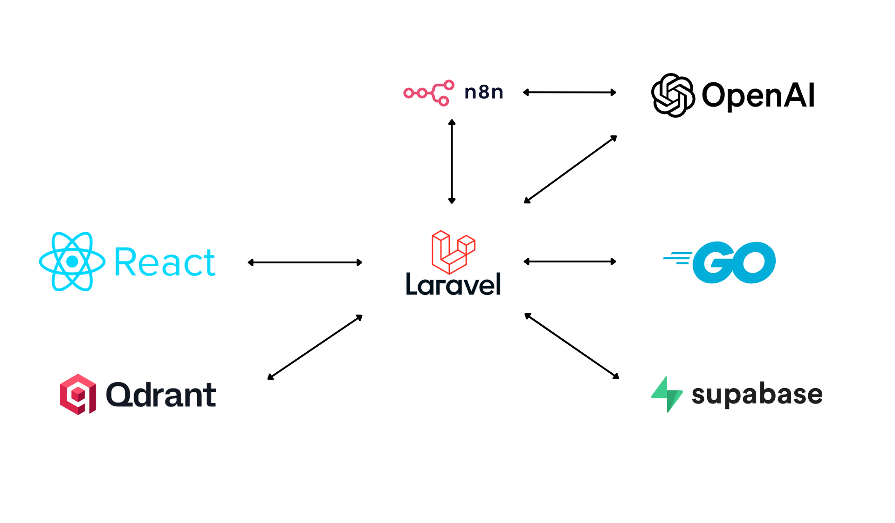
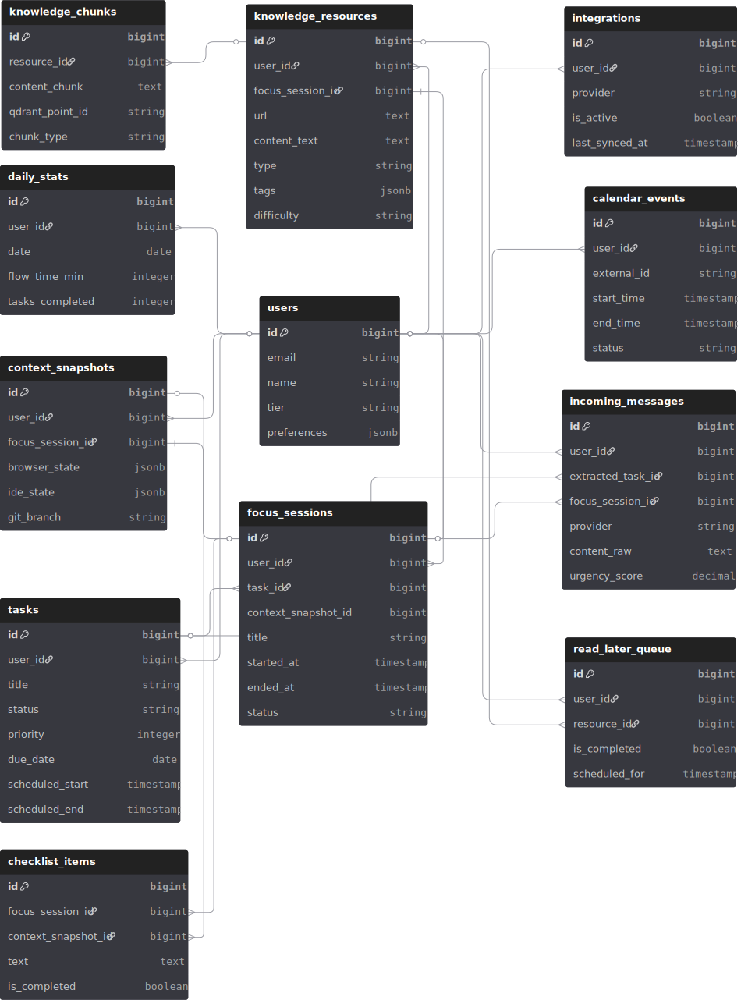

  

## License

do
This project is licensed under the MIT License - see the [LICENSE](LICENSE) file for details.

  

<!-- project overview -->

> Lock In is an AI-powered productivity operating system designed to centralize your work, manage your focus, and turn noise into signal. By combining intelligent **Context Snapshots** for seamless task switching, advanced **Time Management** tools, and an AI-driven **Resource Hub**, LockIn ensures you never lose your flow state.

  

<!-- system design -->

## System Design

## Entity Relationship Diagram

