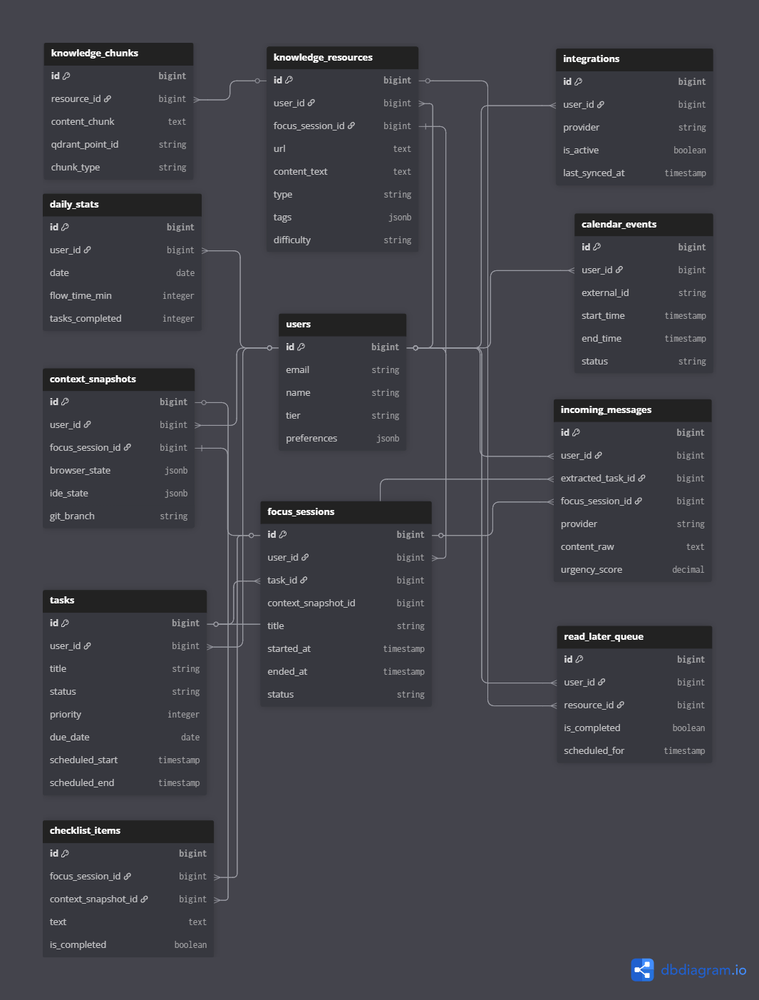

  

## License

do
This project is licensed under the MIT License - see the [LICENSE](LICENSE) file for details.

  

<!-- project overview -->

> Lock In is an AI-powered productivity operating system designed to centralize your work, manage your focus, and turn noise into signal. By combining intelligent **Context Snapshots** for seamless task switching, advanced **Time Management** tools, and an AI-driven **Resource Hub**, LockIn ensures you never lose your flow state.

  

<!-- system design -->

## System Design

## Entity Relationship Diagram

## n8n Workflows

  

<!-- Demo -->

### User Screens & Demos

|                        Landing Dark                         |                        Landing Light                         |
| :---------------------------------------------------------: | :----------------------------------------------------------: |
|  |  |

|                        Onboarding                         |                        Dashboard Dark                         |
| :-------------------------------------------------------: | :-----------------------------------------------------------: |
|  |  |

|                        Dashboard Light                         |                        Dashboard with Items                         |
| :------------------------------------------------------------: | :-----------------------------------------------------------------: |
|  |  |

|                        Calendar                         |                        Calendar Empty                         |
| :-----------------------------------------------------: | :-----------------------------------------------------------: |
|  |  |

|                        Stats with Data                        |                        Stats Empty                         |
| :-----------------------------------------------------------: | :--------------------------------------------------------: |
|  |  |

|                        Context History                         |                        Context History Empty                         |
| :------------------------------------------------------------: | :------------------------------------------------------------------: |
|  |  |

|                        Save Context                         |                        Resource Hub                         |
| :---------------------------------------------------------: | :---------------------------------------------------------: |
|  |  |

|                        Resource Hub Details                         |                        Resource Hub Empty                         |
| :-----------------------------------------------------------------: | :---------------------------------------------------------------: |
|  |  |

| Image Resource Hub |
| :----------------: |

| 
