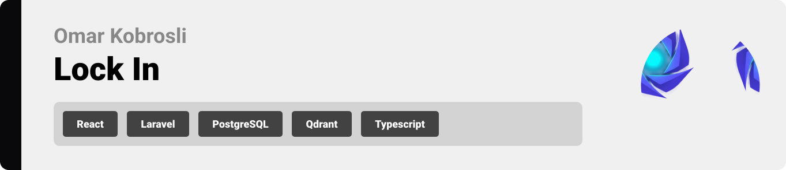

  

## License

do
This project is licensed under the MIT License - see the [LICENSE](LICENSE) file for details.

  

<!-- project overview -->
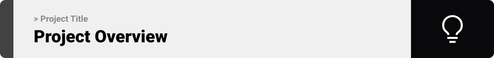

> Lock In is an AI-powered productivity operating system designed to centralize your work, manage your focus, and turn noise into signal. By combining intelligent **Context Snapshots** for seamless task switching, advanced **Time Management** tools, and an AI-driven **Resource Hub**, LockIn ensures you never lose your flow state.

  

<!-- system design -->
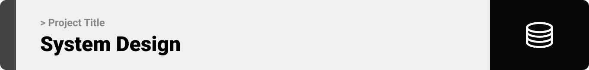

## System Design

## Entity Relationship Diagram

## n8n Workflows

  

## Key Features

- **Context Snapshots**: Instantly saves and restores your entire workspace—including open browser tabs, and active Git branches—so you can switch tasks without losing context.

- **RAG-Powered Second Brain**: A "Talk to Your Data" engine that indexes your personal docs and logs into a vector database, allowing the AI to give grounded answers specific to your work.

- **Bayesian Noise Filter**: A high-performance Go microservice that learns from your behavior to automatically classify notifications as "Important" or "Noise," protecting your focus.

- **Active Flow Coach**: An embedded AI agent that doesn't just chat but actively unblocks you by generating dynamic checklists and pulling relevant documentation while you work.

 

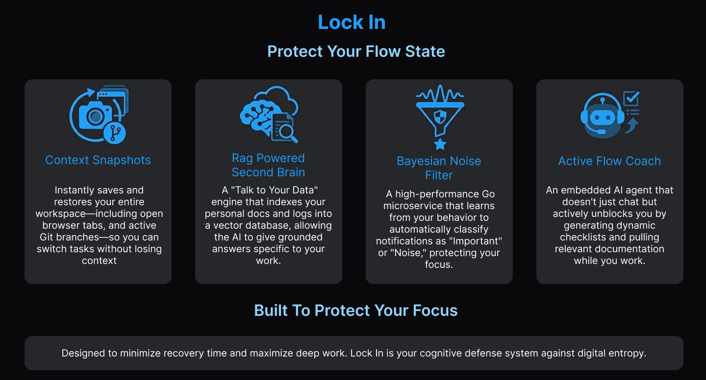

  

<!-- Demo -->

## User Screens & Demos

|                       Landing (Dark)                        |                       Landing (Light)                        |
| :---------------------------------------------------------: | :----------------------------------------------------------: |
|  |  |

|                        Onboarding                         |                       Dashboard (Dark)                        |
| :-------------------------------------------------------: | :-----------------------------------------------------------: |
| 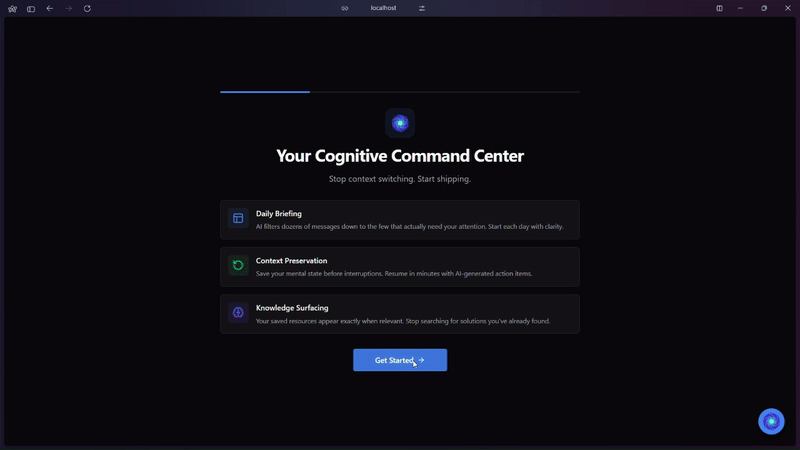 |  |

|                       Dashboard (Light)                        |                       Dashboard (with Items)                        |
| :------------------------------------------------------------: | :-----------------------------------------------------------------: |
|  |  |

|                  Calendar (with Data)                   |                       Calendar (Empty)                        |
| :-----------------------------------------------------: | :-----------------------------------------------------------: |
| 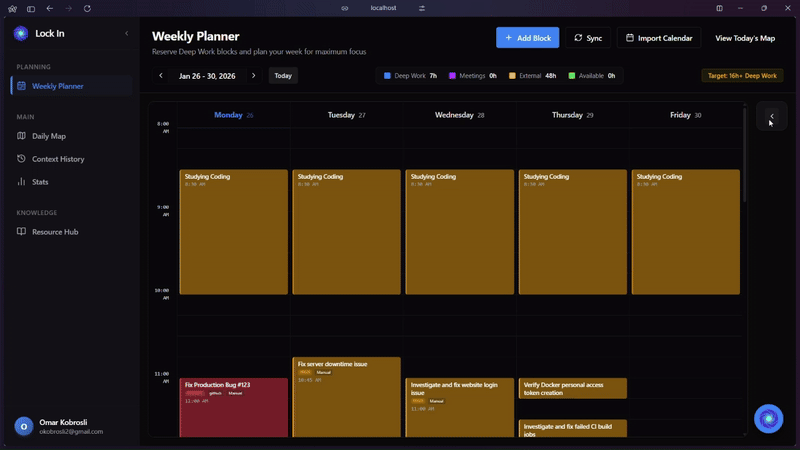 |  |

|                       Stats (with Data)                       |                       Stats (Empty)                        |
| :-----------------------------------------------------------: | :--------------------------------------------------------: |
|  |  |

|                  Context History (with Data)                   |                       Context History (Empty)                        |
| :------------------------------------------------------------: | :------------------------------------------------------------------: |
|  |  |

|                        Save Context                         |                  Resource Hub (with Data)                   |
| :---------------------------------------------------------: | :---------------------------------------------------------: |
|  |  |

|                      Resource Hub (with Data)                       |                       Resource Hub (Empty)                        |
| :-----------------------------------------------------------------: | :---------------------------------------------------------------: |
|  |  |

|                       Resource Hub (Image)                        |                        AI Chatbot                         |
| :---------------------------------------------------------------: | :-------------------------------------------------------: |
|  |  |

  

<!-- development and testing -->

## Development & Implementation

### Services & Validation

|                     Services                     |                     Validation                     |                  Testing                   |
| :----------------------------------------------: | :------------------------------------------------: | :----------------------------------------: |
| 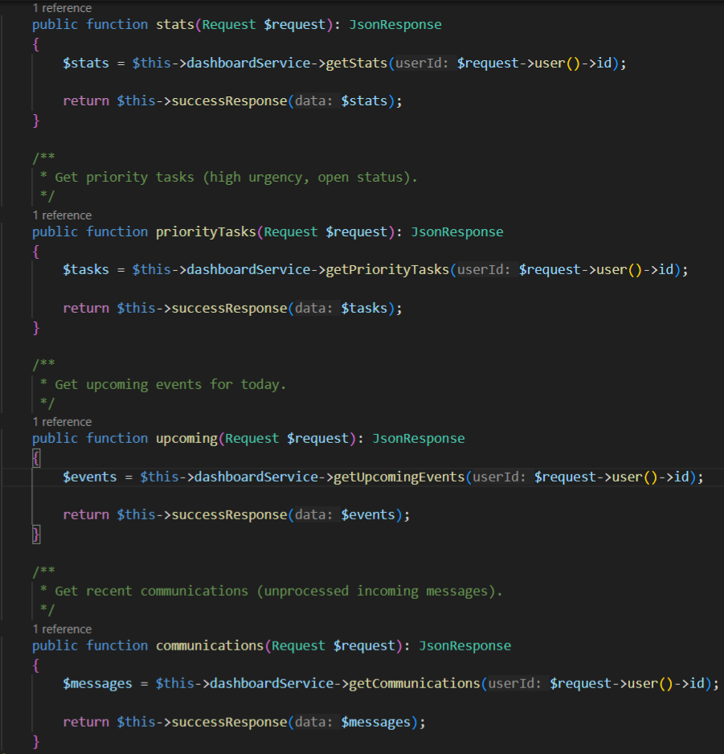 | 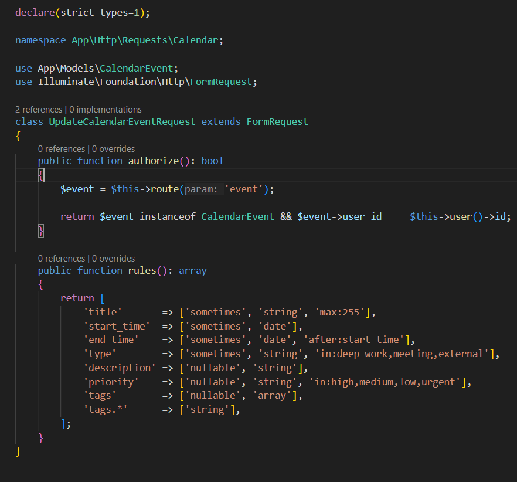 | 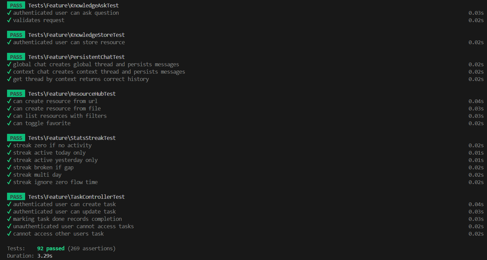 |

  

### RAG AI Assistant

The AI assistant is powered by a Retrieval-Augmented Generation (RAG) pipeline. User resources are chunked, embedded using OpenAI embeddings, and stored in a Qdrant vector database for semantic search. The assistant uses OpenAI function calling to execute tools like creating tasks or listing resources.

|             Knowledge Chunks (Database)              |             RAG Assistant Tools             |
| :--------------------------------------------------: | :-----------------------------------------: |
| 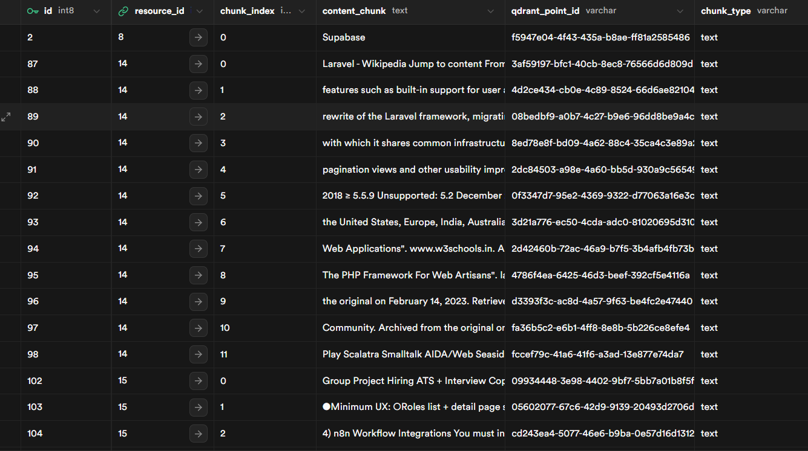 | 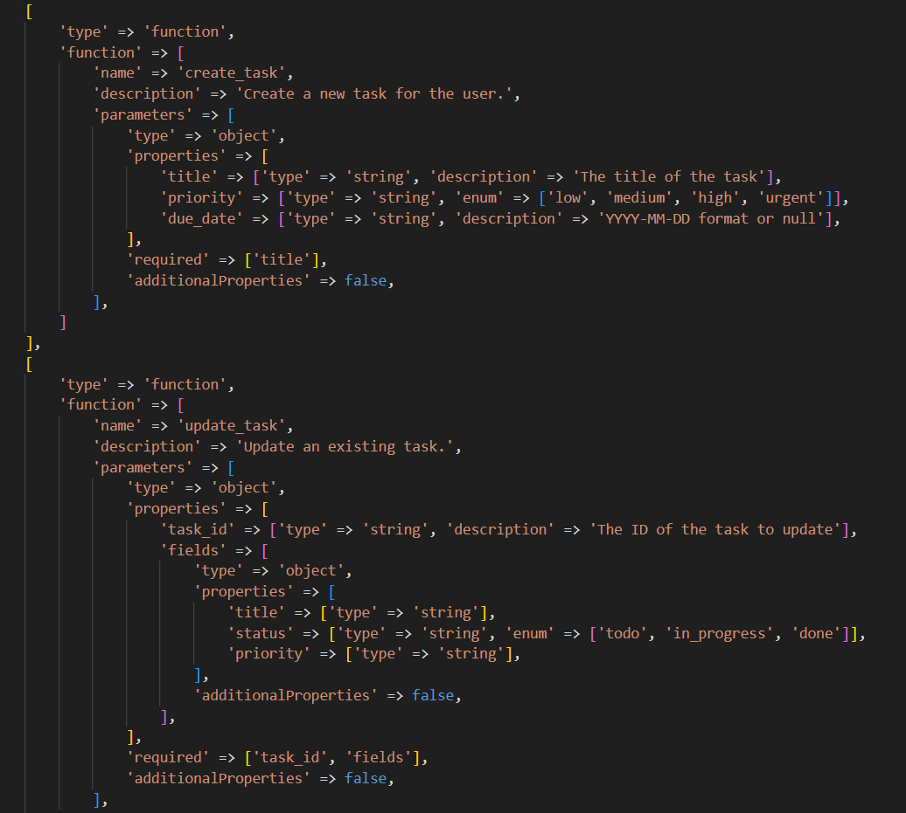 |

  

### Integrations & Message Processing

Users can authenticate with **Google** or **GitHub** for seamless login. Connected integrations like **Slack** and **Gmail** allow the system to receive messages, which are processed through an n8n automation workflow.

|             n8n Workflow             |
| :----------------------------------: |
| 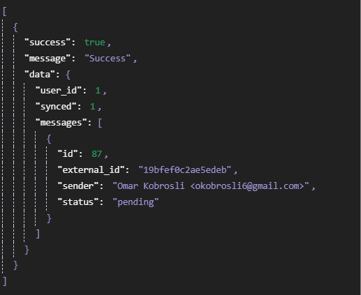 |

  

### ML Message Classification

A Go-based microservice uses Bayesian classification to filter incoming messages as **Important** or **Noise**, protecting focus time by surfacing only what matters.

|              Important Classification               |            Noise Classification             |
| :-------------------------------------------------: | :-----------------------------------------: |
| 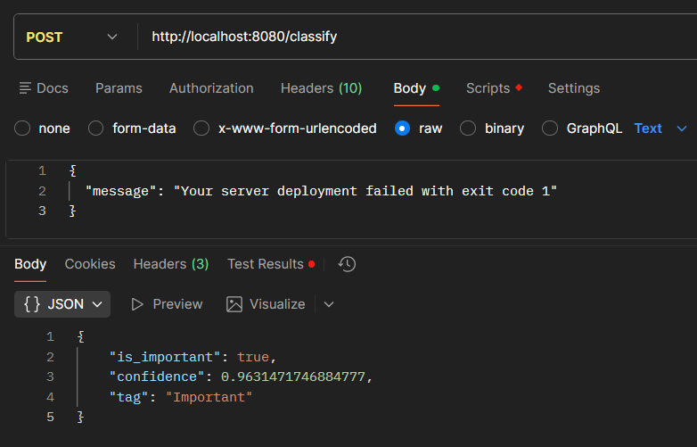 | 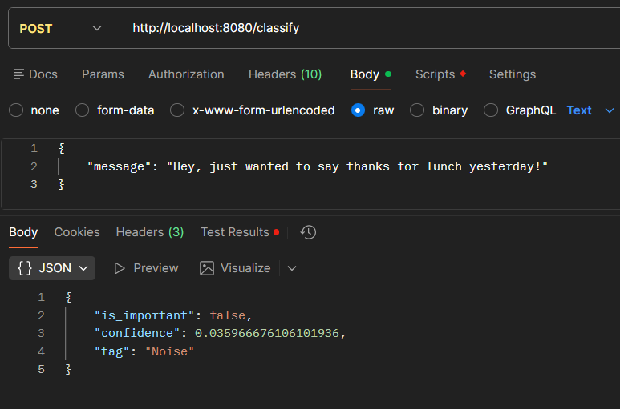 |

  

<!-- deployment -->

## Deployment

### GitHub Actions

|             CI Tests              |             CD Deploy             |
| :-------------------------------: | :-------------------------------: |
| 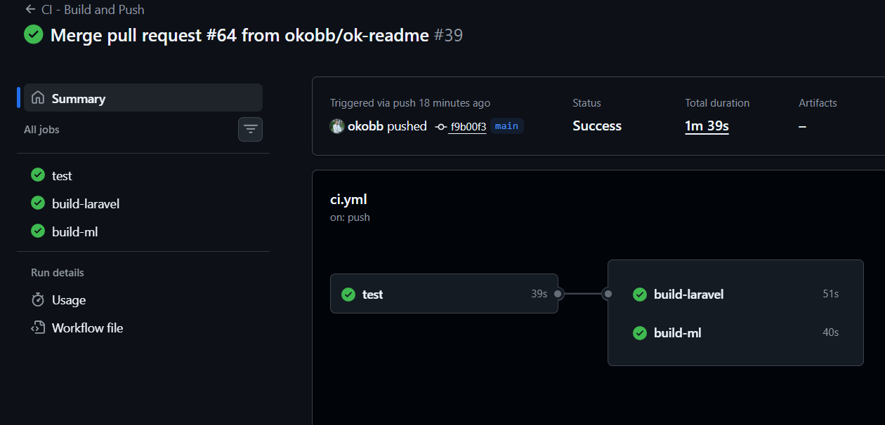 | 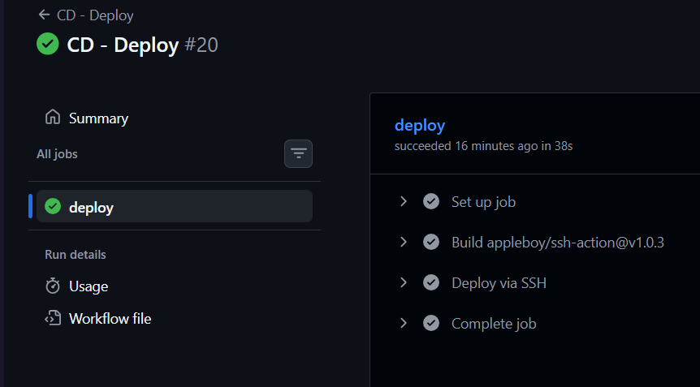 |

  

### API Validation

Production API endpoints validated via Postman to ensure the deployed service is operational.
| User Login | Create Task | View Tasks |
| :----------: | :--------------: | :--------------: |
| 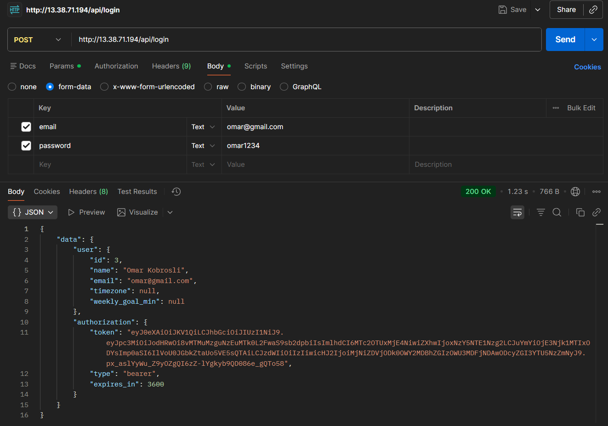 | 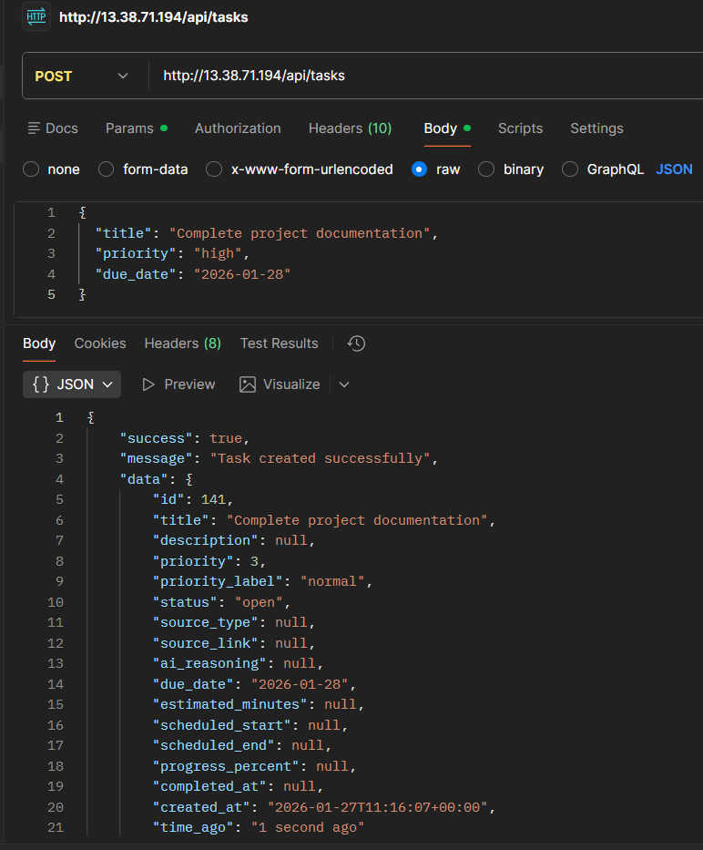 | 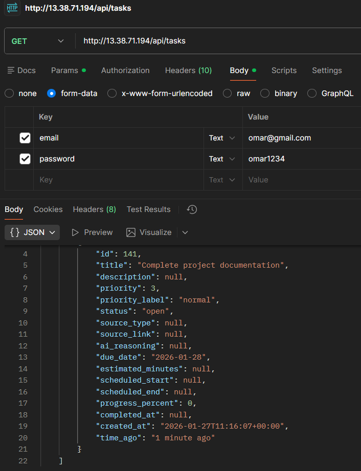 |
